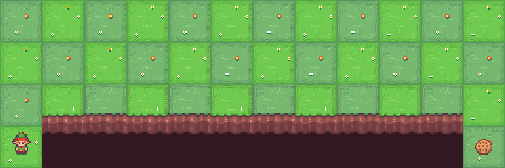

# Cliff Walking Reinforcement Learning

| SARSA                                      | Q-LEARN                                      |
| -------------------------------------------- | -------------------------------------------- |
|         |         |

This project demonstrates the implementation of the Cliff Walking problem using two different reinforcement learning algorithms: SARSA and Q-learning. The Cliff Walking problem is a standard example in reinforcement learning, discussed as Example 6.6 on page 132 of the book "Reinforcement Learning: An Introduction" by Richard S. Sutton and Andrew G. Barto.

## Overview

The Cliff Walking environment is a gridworld (4x12) where an agent starts at the start position and must reach the goal position while avoiding falling off the cliff. The agent receives a reward of -1 for each step and a reward of -100 if it falls off the cliff. The goal is to find an optimal path from the start to the goal with the maximum cumulative reward.

## Algorithms

- **SARSA (State-Action-Reward-State-Action)**: An on-policy algorithm that updates the Q-values using the action taken by the policy.
- **Q-learning**: An off-policy algorithm that updates the Q-values using the maximum action value from the next state.

## Documentation

For more information about the Cliff Walking environment, please visit the [official documentation](https://gymnasium.farama.org/environments/toy_text/cliff_walking/).
